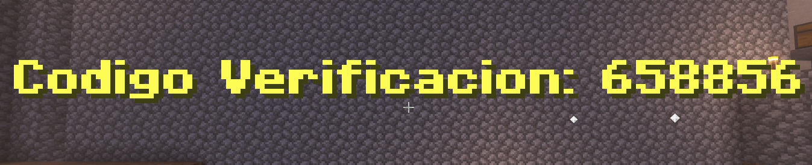
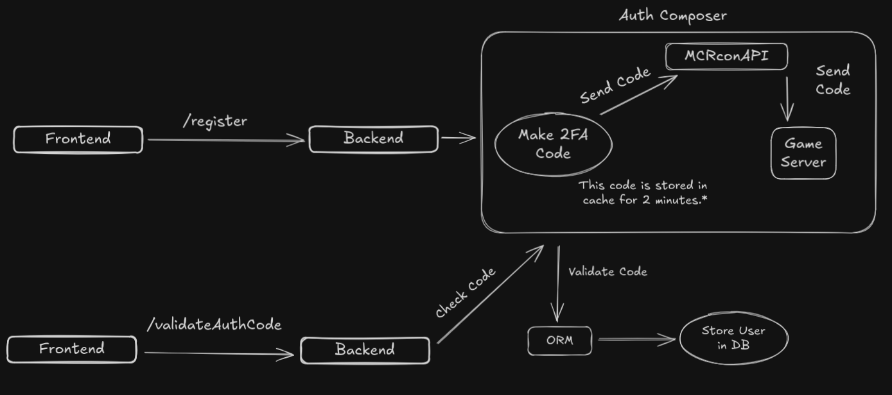

# Minecraft Server Landing Page

Este es un proyecto personal para hacer una landing page basica para un servidor de Minecraft, donde se podra ver informacion basica del mismo.

La clave de este proyecto es poder ofrecer a los usuarios del servidor una web para informarse de las novedades del servidor y tener la capacidad de interartuar con el juego mediante una interfaz web y poder tener un sitio para nuestra comunidad.

## Autenticacion

Para poder resgitrarse en la web es necesario realizar una verificacion en dos pasos (2FA), pero en vez de ser mediante servicios como Google u otros, lo hacemos directamente contra nuestro servidor de juego.

Luego solo deberas poner el codigo de verificacion en el formulario y te habras registrado.

